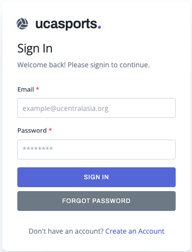
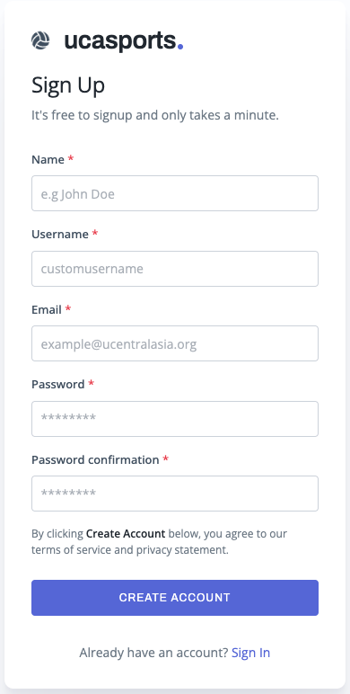
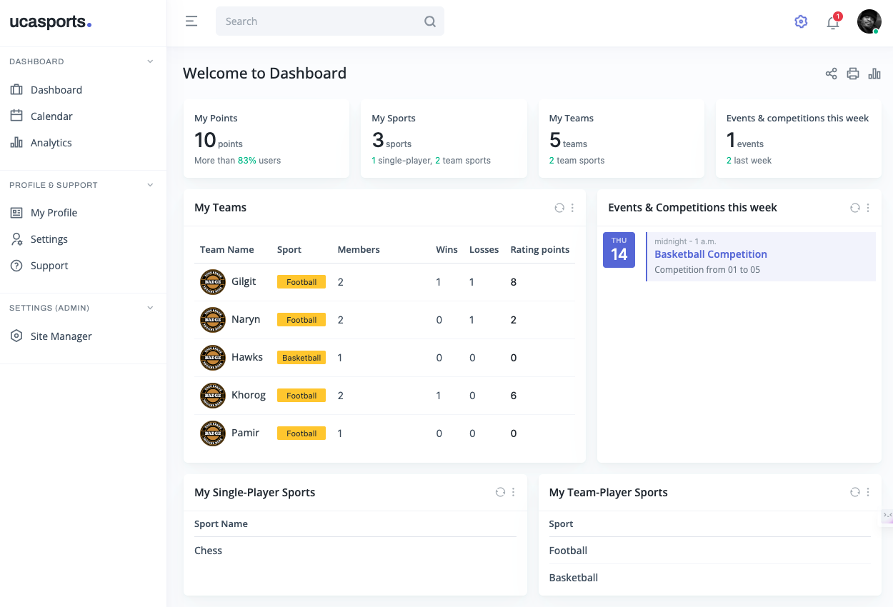
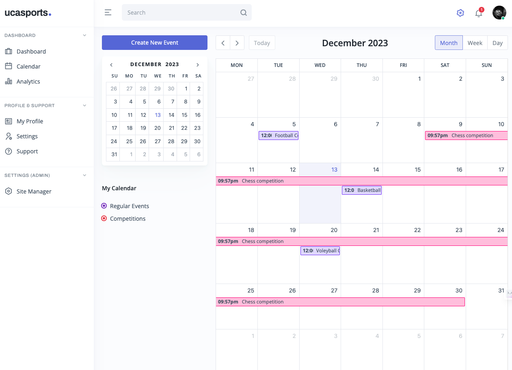
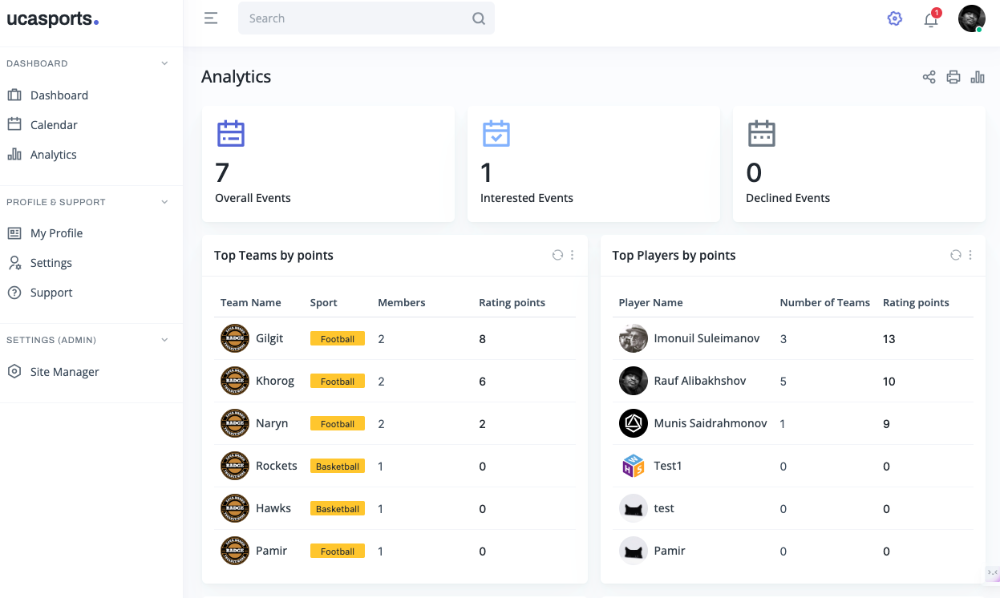

# SportsHub

A modern web-based sports management system built with Django for organizing teams, players, competitions, and events.

## Features

- **User Management** - Secure authentication with email verification
- **Team Management** - Create and manage sports teams
- **Player Profiles** - Track player information and statistics
- **Competition Management** - Schedule and manage tournaments
- **Event Organization** - Plan sports events with participant tracking
- **Analytics Dashboard** - View performance metrics and statistics
- **Calendar Integration** - Visual event scheduling
- **REST API** - Complete API for integrations

## Quick Start

### Prerequisites
- Python 3.8+
- pip

### Installation

1. **Clone the repository**
   ```bash
   git clone <your-repository-url>
   cd sports-management-system
   ```

2. **Create virtual environment**
   ```bash
   python -m venv venv
   source venv/bin/activate  # Windows: venv\Scripts\activate
   ```

3. **Install dependencies**
   ```bash
   pip install -r requirements.txt
   ```

4. **Set up environment variables**
   Create a `.env` file:
   ```env
   SECRET_KEY=your-secret-key-here
   DEBUG=True
   CONTACT_EMAIL=admin@yourdomain.com
   ADMIN_EMAIL=admin@yourdomain.com
   ```

5. **Run migrations**
   ```bash
   python manage.py migrate
   ```

6. **Create superuser**
   ```bash
   python manage.py createsuperuser
   ```

7. **Start the server**
   ```bash
   python manage.py runserver
   ```

8. **Access the application**
   - Main app: http://localhost:8000
   - Admin panel: http://localhost:8000/admin

## Screenshots







## Technology Stack

- **Backend**: Django 4.2, Django REST Framework
- **Frontend**: HTML5, CSS3, JavaScript, Bootstrap
- **Database**: SQLite (development), PostgreSQL (production)
- **Authentication**: Django's built-in system
- **Email**: SendGrid integration

## Project Structure

```
sports-management-system/
├── core/                   # Django project settings
├── sports/                 # Main application
│   ├── api/               # REST API endpoints
│   ├── models.py          # Data models
│   ├── views.py           # View logic
│   └── forms.py           # Form definitions
├── templates/             # HTML templates
├── static/                # Static files (CSS, JS, images)
└── requirements.txt       # Dependencies
```

## API Endpoints

- `GET /api/teams/` - List all teams
- `GET /api/players/` - List all players
- `GET /api/competitions/` - List all competitions
- `GET /api/events/` - List all events
- `POST /api/teams/` - Create new team
- `PUT /api/teams/{id}/` - Update team
- `DELETE /api/teams/{id}/` - Delete team

## Usage

### For Administrators
1. Access admin panel at `/admin`
2. Create sports categories and teams
3. Manage user accounts and permissions

### For Team Managers
1. Register and verify your account
2. Create or join teams
3. Schedule competitions and events
4. Track team performance

### For Players
1. Create your profile
2. Join teams and participate in events
3. View your performance statistics

## Contributing

1. Fork the repository
2. Create a feature branch (`git checkout -b feature/amazing-feature`)
3. Commit your changes (`git commit -m 'Add amazing feature'`)
4. Push to the branch (`git push origin feature/amazing-feature`)
5. Open a Pull Request

## License

This project is licensed under the MIT License - see the [LICENSE](LICENSE) file for details.

## Support

For support and questions:
- Create an issue in the GitHub repository
- Check the documentation in the `/docs` folder

---

**Built with ❤️ for the sports community**